# Accredit Platform - High-Level Architecture

## System Architecture Diagram

```mermaid
graph TB
    subgraph "External Users"
        User[User Browser]
        Mobile[Mobile Device]
    end

    subgraph "External Services"
        Stripe[Stripe API<br/>Payment Processing]
        Zoom[Zoom API<br/>Video Conferencing]
        Mailgun[Mailgun<br/>Email Service]
        StripeWebhook[Stripe Webhooks]
        ZoomWebhook[Zoom Webhooks]
    end

    subgraph "Frontend Layer - React SPA"
        Frontend[React + TypeScript<br/>Vite Build<br/>Tailwind CSS + Radix UI]
        Router[React Router v6]
        StateManagement[TanStack Query<br/>Context API]
        Forms[React Hook Form<br/>Zod Validation]
        StripeJS[Stripe.js<br/>Elements]
    end

    subgraph "CDN & Static Assets"
        CloudCDN[Google Cloud CDN<br/>Global Distribution]
        StaticBucket[GCS Bucket<br/>Frontend Assets]
        LoadBalancer[HTTPS Load Balancer<br/>SSL/TLS Termination]
    end

    subgraph "Backend Layer - Django REST API"
        direction TB
        API[Django REST Framework<br/>API Gateway]
        
        subgraph "Core Modules"
            Accounts[Accounts<br/>Authentication & Profiles]
            Events[Events<br/>Event Management]
            Registrations[Registrations<br/>Attendance Tracking]
            Certificates[Certificates<br/>PDF Generation]
            Learning[Learning<br/>LMS & Courses]
            Organizations[Organizations<br/>Multi-tenant]
            Billing[Billing<br/>Subscriptions]
            Integrations[Integrations<br/>Zoom, Email, Webhooks]
            Feedback[Feedback<br/>Surveys]
            PromoCodes[Promo Codes<br/>Discounts]
            Badges[Badges<br/>Achievements]
            Contacts[Contacts<br/>CRM]
        end
        
        Auth[JWT Authentication<br/>djangorestframework-simplejwt]
    end

    subgraph "Data Layer"
        PostgreSQL[(PostgreSQL<br/>Cloud SQL<br/>Primary Database)]
        
        subgraph "Cloud Storage Buckets"
            MediaBucket[Media Files<br/>Public Read]
            CertBucket[Certificates<br/>Private]
        end
    end

    subgraph "Async Processing"
        CloudTasks[GCP Cloud Tasks<br/>Queue Service]
        TaskWorkers[Task Workers<br/>Email, Certificates,<br/>Webhooks]
    end

    subgraph "Infrastructure - GCP"
        CloudRun[Cloud Run<br/>Serverless Containers<br/>Auto-scaling 0-10]
        VPC[VPC Network<br/>Private Networking]
        SecretManager[Secret Manager<br/>API Keys & Secrets]
        IAM[IAM & Service Accounts<br/>Access Control]
    end

    subgraph "Development Tools"
        CLI[Accredit CLI<br/>Python Tool<br/>Deployment Automation]
        Docker[Docker Compose<br/>Local Development<br/>Emulators]
        Terraform[Terraform<br/>Infrastructure as Code]
    end

    %% User to Frontend
    User --> LoadBalancer
    Mobile --> LoadBalancer
    LoadBalancer --> CloudCDN
    CloudCDN --> StaticBucket
    CloudCDN --> Frontend
    
    %% Frontend Internal
    Frontend --> Router
    Frontend --> StateManagement
    Frontend --> Forms
    Frontend --> StripeJS
    
    %% Frontend to Backend
    Frontend --> API
    StripeJS -.-> Stripe
    
    %% API to Core Modules
    API --> Auth
    API --> Accounts
    API --> Events
    API --> Registrations
    API --> Certificates
    API --> Learning
    API --> Organizations
    API --> Billing
    API --> Integrations
    API --> Feedback
    API --> PromoCodes
    API --> Badges
    API --> Contacts
    
    %% Core Modules to Data
    Accounts --> PostgreSQL
    Events --> PostgreSQL
    Registrations --> PostgreSQL
    Certificates --> PostgreSQL
    Learning --> PostgreSQL
    Organizations --> PostgreSQL
    Billing --> PostgreSQL
    Feedback --> PostgreSQL
    PromoCodes --> PostgreSQL
    Badges --> PostgreSQL
    Contacts --> PostgreSQL
    
    %% Storage
    Certificates --> CertBucket
    Events --> MediaBucket
    Learning --> MediaBucket
    
    %% External Integrations
    Billing -.-> Stripe
    Integrations -.-> Zoom
    Integrations -.-> Mailgun
    StripeWebhook -.-> API
    ZoomWebhook -.-> API
    
    %% Async Processing
    API --> CloudTasks
    CloudTasks --> TaskWorkers
    TaskWorkers --> Integrations
    TaskWorkers --> Certificates
    TaskWorkers --> Mailgun
    
    %% Infrastructure
    API --> CloudRun
    CloudRun --> VPC
    PostgreSQL --> VPC
    CloudRun --> SecretManager
    CloudRun --> IAM
    
    %% Development
    CLI --> Docker
    CLI --> Terraform
    Terraform --> CloudRun
    Terraform --> PostgreSQL
    Terraform --> CloudCDN
    Terraform --> VPC
    
    %% Styling
    classDef frontend fill:#6b9b7c,stroke:#4a735d,color:#fff
    classDef backend fill:#658877,stroke:#4a735d,color:#fff
    classDef data fill:#496b55,stroke:#3a5a44,color:#fff
    classDef external fill:#a1b5a8,stroke:#7a8f81,color:#2d3e32
    classDef infra fill:#8da895,stroke:#6b8873,color:#fff
    classDef async fill:#7a9984,stroke:#5d7a68,color:#fff
    
    class Frontend,Router,StateManagement,Forms,StripeJS frontend
    class API,Accounts,Events,Registrations,Certificates,Learning,Organizations,Billing,Integrations,Feedback,PromoCodes,Badges,Contacts,Auth backend
    class PostgreSQL,MediaBucket,CertBucket data
    class Stripe,Zoom,Mailgun,StripeWebhook,ZoomWebhook external
    class CloudRun,VPC,SecretManager,IAM,CloudCDN,StaticBucket,LoadBalancer infra
    class CloudTasks,TaskWorkers async
```

## Architecture Overview

### Frontend Layer
- **Technology**: React 18 + TypeScript, Vite, Tailwind CSS + Radix UI
- **State Management**: TanStack Query (React Query) + Context API
- **Routing**: React Router v6
- **Forms**: React Hook Form with Zod validation
- **Payments**: Stripe.js + Stripe Elements
- **Hosting**: Google Cloud Storage + Cloud CDN + HTTPS Load Balancer

### Backend Layer
- **Framework**: Django 4.x + Django REST Framework
- **Authentication**: JWT tokens via djangorestframework-simplejwt
- **API**: RESTful API with OpenAPI/Swagger documentation
- **Modules**: 12 core Django apps handling different domains
- **Hosting**: Google Cloud Run (serverless containers, auto-scaling)

### Data Layer
- **Primary Database**: PostgreSQL 15 (Cloud SQL)
- **Object Storage**: Google Cloud Storage
  - Public bucket for media files
  - Private bucket for certificates
  - CDN bucket for frontend assets

### Async Processing
- **Queue Service**: GCP Cloud Tasks
- **Workers**: Background tasks for emails, certificate generation, webhook processing
- **Execution**: Sync mode (dev) or async (production)

### External Integrations
- **Stripe**: Payment processing, subscriptions, invoicing
- **Zoom**: OAuth integration, meeting management, attendance webhooks
- **Mailgun**: Transactional email delivery

### Infrastructure (Google Cloud Platform)
- **Compute**: Cloud Run (serverless, auto-scaling 0-10 instances)
- **Database**: Cloud SQL (managed PostgreSQL with daily backups)
- **Storage**: Cloud Storage (3 buckets)
- **CDN**: Cloud CDN with HTTPS Load Balancer
- **Networking**: VPC with private networking and VPC connector
- **Security**: Secret Manager, IAM, managed SSL certificates
- **Tasks**: Cloud Tasks for async job processing

### Development & Deployment
- **CLI Tool**: Custom Python CLI (`accredit`) for deployment automation
- **Local Development**: Docker Compose with emulators (Cloud Tasks, GCS)
- **Infrastructure as Code**: Terraform for GCP resources
- **Environments**: Dev, Staging, Production with separate configs

## Data Flow

### User Registration & Authentication Flow
1. User signs up via frontend → API creates account in PostgreSQL
2. JWT token issued → stored in browser
3. Subsequent requests include JWT in Authorization header
4. Backend validates token and identifies user

### Event Creation & Management Flow
1. Organizer creates event → stored in PostgreSQL
2. Zoom integration creates meeting if online event
3. Event published → available in public discovery
4. Media files (images) → uploaded to GCS media bucket

### Registration & Attendance Flow
1. User registers for event → registration record in PostgreSQL
2. Payment processed via Stripe (if paid event)
3. Confirmation email queued via Cloud Tasks → Mailgun delivers
4. Zoom webhook reports attendance → backend updates attendance records
5. Certificate auto-generated → stored in private GCS bucket
6. Certificate notification email sent to attendee

### Course & Learning Flow
1. Instructor creates course with modules → stored in PostgreSQL
2. Course content (videos, documents) → uploaded to GCS media bucket
3. Students enroll → enrollment records in PostgreSQL
4. Progress tracked → quiz results, assignment submissions stored
5. Certificate issued upon completion → generated PDF in GCS

### Billing & Subscription Flow
1. User selects plan → frontend initiates Stripe Checkout
2. Stripe processes payment → webhook to backend
3. Backend creates/updates subscription in PostgreSQL
4. Access control enforced based on subscription status
5. Usage limits tracked per subscription plan

## Deployment Architecture

### Local Development
- Docker Compose with 5 containers:
  - PostgreSQL
  - Cloud Tasks Emulator
  - GCS Emulator
  - Backend (Django)
  - Frontend (Vite dev server)

### Production (GCP)
- Frontend: Cloud Storage + Cloud CDN + Load Balancer
- Backend: Cloud Run (containerized, auto-scaling)
- Database: Cloud SQL (managed PostgreSQL)
- Storage: Cloud Storage (production buckets)
- Tasks: Cloud Tasks (production queue)
- Secrets: Secret Manager
- IaC: Terraform manages all resources

## Security Features

- **Authentication**: JWT tokens with refresh mechanism
- **Authorization**: Role-based access control (RBAC)
- **Data Protection**: 
  - PostgreSQL with SSL
  - Private VPC networking
  - Encrypted secrets in Secret Manager
- **HTTPS**: Managed SSL certificates via Google
- **CORS**: Configured for allowed origins
- **API Security**: Rate limiting, input validation, CSRF protection

## Scalability & Performance

- **Auto-scaling**: Cloud Run scales 0-10 instances based on load
- **CDN**: Global content delivery for frontend assets
- **Database**: Cloud SQL with read replicas (configurable)
- **Caching**: Browser caching + CDN caching (1-hour TTL)
- **Async Processing**: Background jobs don't block API requests
- **Query Optimization**: Database indexing, select_related, prefetch_related

## Monitoring & Observability

- **Logs**: Cloud Run logging (stdout/stderr)
- **Metrics**: GCP monitoring dashboards
- **Errors**: Django error logging + email notifications
- **Health Checks**: Liveness and readiness probes
- **Database**: Cloud SQL metrics and query insights

---

**Note**: This architecture supports multi-tenant organizations, flexible event formats (online/hybrid/in-person), comprehensive LMS capabilities, and full CPD certificate management with automated workflows.
