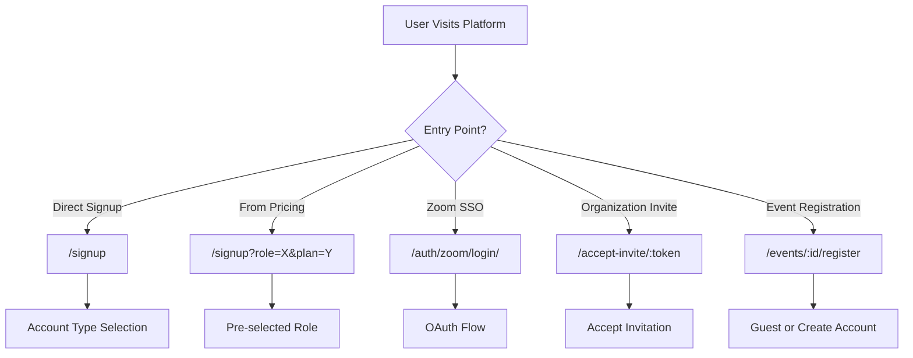
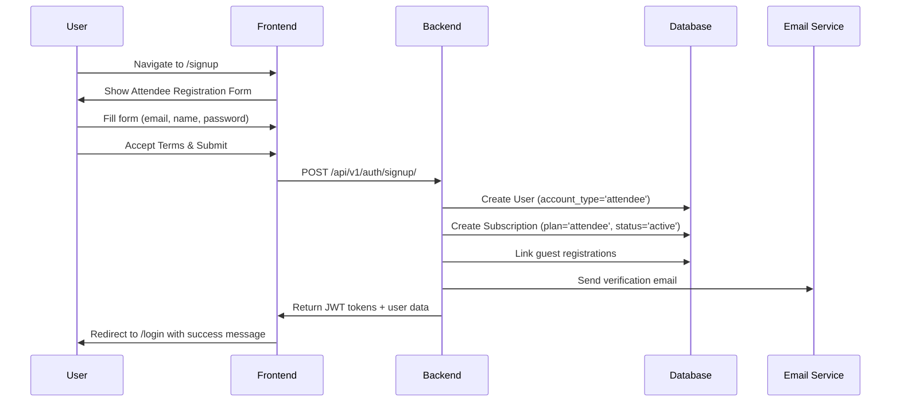
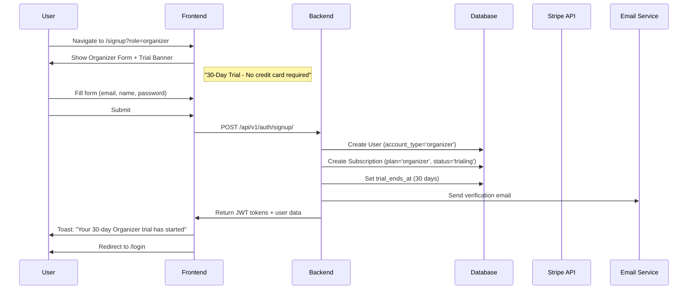
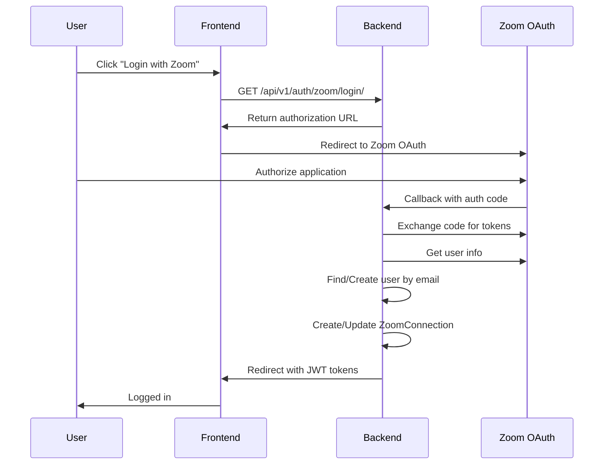
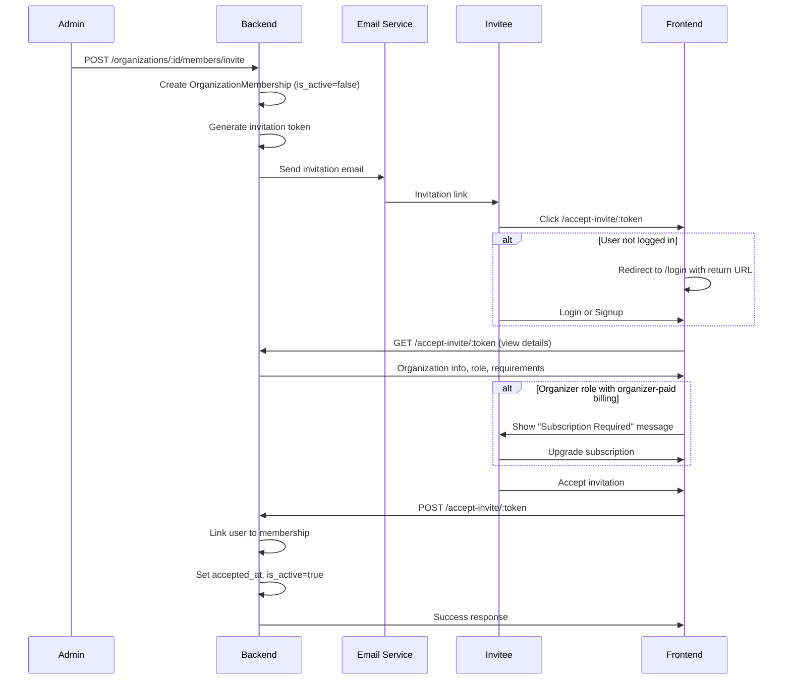
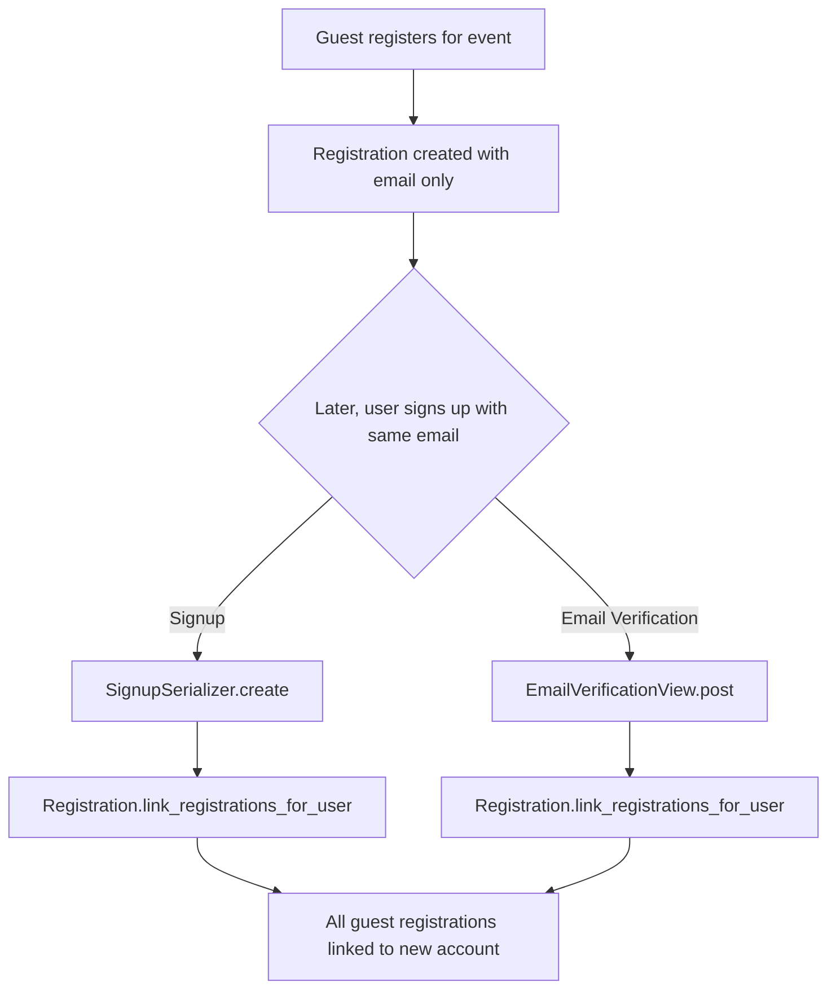
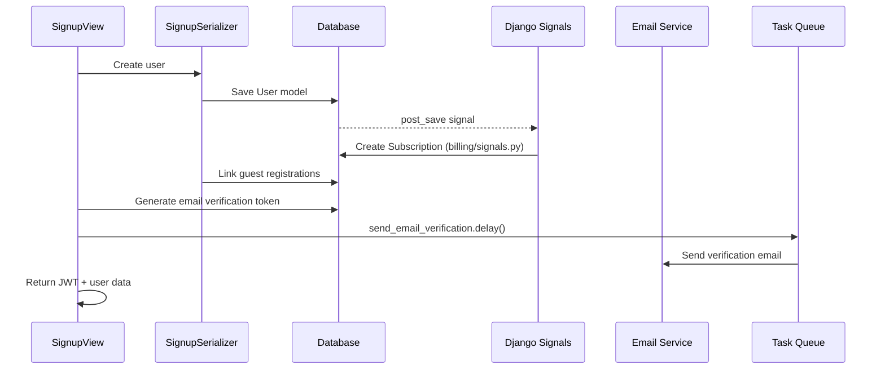

# CPD Events - Signup Workflows Documentation

This document provides comprehensive documentation of the signup workflows for different user types on the CPD Events platform, covering both the user-facing experience and the backend processing.

---

## Table of Contents

1. [Overview](#overview)
2. [User Types & Account Types](#user-types--account-types)
3. [Individual Signup Workflows](#individual-signup-workflows)
   - [Attendee Signup](#1-attendee-signup)
   - [Organizer Signup](#2-organizer-signup)
   - [Course Manager (LMS) Signup](#3-course-manager-lms-signup)
4. [Alternative Authentication Methods](#alternative-authentication-methods)
   - [Zoom SSO Login](#zoom-sso-login)
5. [Organization Member Signup](#organization-member-signup)
6. [Guest Registration → Account Creation](#guest-registration--account-creation)
7. [Post-Signup Processes](#post-signup-processes)
8. [API Reference](#api-reference)
9. [Database Changes on Signup](#database-changes-on-signup)

---

## Overview

The CPD Events platform supports multiple signup pathways depending on the user's intended role:



---

## User Types & Account Types

The platform distinguishes between three primary account types:

| Account Type | Database Value | Description | Trial Period |
|--------------|----------------|-------------|--------------|
| **Attendee** | `attendee` | Default user who attends events | None (Free) |
| **Organizer** | `organizer` | Can create and manage events | 30 days (configurable) |
| **Course Manager** | `course_manager` | Can create and manage LMS courses | 30 days (configurable) |

### Backend Model Reference

**File:** [models.py](file:///home/beyonder/projects/cpd_events/backend/src/accounts/models.py#L74-L77)

```python
class AccountType(models.TextChoices):
    ATTENDEE = 'attendee', 'Attendee'
    ORGANIZER = 'organizer', 'Organizer'
    COURSE_MANAGER = 'course_manager', 'Course Manager'
```

---

## Individual Signup Workflows

### 1. Attendee Signup

#### User Flow



#### Frontend Experience

**URL:** `/signup` (no query parameters)

**Form Fields:**
- Email address (required)
- Full Name (required, min 2 chars)
- Password (required, min 8 chars)
- Confirm Password (required, must match)
- Accept Terms & Conditions (required checkbox)

**Frontend File:** [SignupPage.tsx](file:///home/beyonder/projects/cpd_events/frontend/src/pages/auth/SignupPage.tsx)

#### Backend Processing

1. **User Creation** - Creates user record with `account_type='attendee'`
2. **Subscription Creation** - Signal creates an `ATTENDEE` plan subscription (free, active)
3. **Registration Linking** - Links any guest registrations with same email
4. **Email Verification** - Generates token and sends verification email

**API Endpoint:** `POST /api/v1/auth/signup/`

**Request Body:**
```json
{
  "email": "user@example.com",
  "password": "securepassword",
  "password_confirm": "securepassword",
  "full_name": "John Doe",
  "account_type": "attendee"
}
```

**Response (201 Created):**
```json
{
  "message": "Account created successfully. Please check your email.",
  "access": "<jwt_access_token>",
  "refresh": "<jwt_refresh_token>",
  "user": {
    "uuid": "...",
    "email": "user@example.com",
    "full_name": "John Doe",
    "account_type": "attendee"
  }
}
```

---

### 2. Organizer Signup

#### User Flow



#### Frontend Experience

**URL:** `/signup?role=organizer` or `/signup?plan=organizer`

**Additional UI Elements:**
- Trial banner: "30-Day Trial - Full access to all features. No credit card required."
- Organizer benefits card with feature list:
  - Create unlimited events (with plan limits)
  - Zoom integration for attendance tracking
  - Issue professional certificates
  - Accept payments for paid events

**Button Text:** "Create Organizer Account"

#### Backend Processing

Same as attendee but with key differences:

1. **User Creation** - `account_type='organizer'`
2. **Subscription Creation** - Signal creates `ORGANIZER` plan with:
   - `status='trialing'`
   - `trial_ends_at` set based on StripeProduct configuration (default 30 days)

**Backend Signal:** [signals.py](file:///home/beyonder/projects/cpd_events/backend/src/billing/signals.py#L13-L59)

```python
@receiver(post_save, sender=settings.AUTH_USER_MODEL)
def create_subscription_for_organizer(sender, instance, created, **kwargs):
    if not created:
        return
    
    if instance.account_type == 'organizer':
        plan = Subscription.Plan.ORGANIZER
        # Fetch trial days from StripeProduct configuration
        product = StripeProduct.objects.filter(plan=plan, is_active=True).first()
        trial_days = product.trial_period_days if product else 0
        
        Subscription.objects.get_or_create(
            user=instance,
            defaults={
                'plan': plan,
                'status': Subscription.Status.TRIALING,
                'trial_ends_at': timezone.now() + timedelta(days=trial_days),
            },
        )
```

---

### 3. Course Manager (LMS) Signup

#### User Flow

Identical to Organizer signup with different URL parameters.

**URL:** `/signup?role=course_manager` or `/signup?plan=lms`

**Additional UI Elements:**
- LMS benefits card:
  - Build self-paced courses and modules
  - Track learner progress and completion
  - Issue course completion certificates
  - Accept payments for paid courses

#### Backend Processing

1. **User Creation** - `account_type='course_manager'`
2. **Subscription Creation** - Signal creates `LMS` plan with:
   - `status='trialing'`
   - `trial_ends_at` based on LMS product configuration

---

## Alternative Authentication Methods

### Zoom SSO Login

Users can authenticate using their Zoom account. This creates/links a user account automatically.

#### Flow



#### Backend Processing

**Callback View:** [views.py](file:///home/beyonder/projects/cpd_events/backend/src/accounts/views.py#L640-L748)

1. **Token Exchange** - Exchange authorization code for access/refresh tokens
2. **User Info Fetch** - Get email, name from Zoom API
3. **User Matching** - First by ZoomConnection, then by email
4. **User Creation** (if new):
   - `email_verified=True` (Zoom emails trusted)
   - `password=None` (unusable password)
5. **ZoomConnection Creation** - Store OAuth tokens for future API calls
6. **JWT Generation** - Create access/refresh tokens

---

## Organization Member Signup

Organizations can invite members via email. Invitees receive a token-based invitation link.

### Invitation Flow



### Organization Membership Roles

| Role | Description | Billing |
|------|-------------|---------|
| `admin` | Organization manager | Included in base plan |
| `organizer` | Can create events under org | Per-seat or self-paid |
| `course_manager` | Can manage LMS courses | Per-seat billing |
| `instructor` | Assigned to specific courses | Free |

### Backend Endpoints

**Invite Member:** `POST /api/v1/organizations/:uuid/members/invite/`

**Request:**
```json
{
  "email": "member@example.com",
  "role": "organizer",
  "title": "Senior Trainer",
  "billing_payer": "organization"  // or "organizer"
}
```

**Accept Invitation:** `POST /api/v1/accept-invite/:token/`

**View Source:** [views.py](file:///home/beyonder/projects/cpd_events/backend/src/organizations/views.py#L202-L446)

---

## Guest Registration → Account Creation

Users can register for events as guests, then later create an account to link their registrations.

### Flow



### Backend Implementation

**Linking Logic:** [serializers.py](file:///home/beyonder/projects/cpd_events/backend/src/accounts/serializers.py#L66-L70)

```python
def create(self, validated_data):
    # ... create user ...
    
    # Link any guest registrations
    from registrations.models import Registration
    Registration.link_registrations_for_user(user)
    
    return user
```

The linking also occurs:
- During email verification ([views.py](file:///home/beyonder/projects/cpd_events/backend/src/accounts/views.py#L126-L129))
- During signup view response ([views.py](file:///home/beyonder/projects/cpd_events/backend/src/accounts/views.py#L60-L62))

---

## Post-Signup Processes

### Sequence of Backend Events



### Email Verification Flow

1. **Token Generation** - 32-character random token stored on user
2. **Email Sent** - Contains link: `{FRONTEND_URL}/auth/verify-email?token={token}`
3. **Token Validity** - 24 hours from generation
4. **Verification** - `POST /api/v1/auth/verify-email/` with token

**Verification View:** [views.py](file:///home/beyonder/projects/cpd_events/backend/src/accounts/views.py#L97-L131)

---

## API Reference

### Authentication Endpoints

| Endpoint | Method | Description |
|----------|--------|-------------|
| `/api/v1/auth/signup/` | POST | Create new user account |
| `/api/v1/auth/token/` | POST | Login (get JWT tokens) |
| `/api/v1/auth/verify-email/` | POST | Verify email with token |
| `/api/v1/auth/password-reset/` | POST | Request password reset |
| `/api/v1/auth/password-reset/confirm/` | POST | Confirm password reset |
| `/api/v1/auth/zoom/login/` | GET | Get Zoom OAuth URL |
| `/api/v1/auth/zoom/callback/` | GET | Zoom OAuth callback |

### Organization Invitation Endpoints

| Endpoint | Method | Description |
|----------|--------|-------------|
| `/api/v1/organizations/:uuid/members/invite/` | POST | Invite member |
| `/api/v1/accept-invite/:token/` | GET | View invitation details |
| `/api/v1/accept-invite/:token/` | POST | Accept invitation |

---

## Database Changes on Signup

### Tables Modified

| Table | Action | Conditions |
|-------|--------|------------|
| `users` | INSERT | Always |
| `subscriptions` | INSERT | Always (via signal) |
| `registrations` | UPDATE | If guest registrations exist with same email |
| `zoom_connections` | INSERT | Only for Zoom SSO signup |
| `organization_memberships` | UPDATE | Only for invitation acceptance |
| `user_sessions` | INSERT | On subsequent login |

### User Table Fields Populated

```sql
-- New user record structure
INSERT INTO users (
    uuid,              -- Auto-generated
    email,             -- From form
    full_name,         -- From form
    account_type,      -- 'attendee' | 'organizer' | 'course_manager'
    password,          -- Hashed (or NULL for SSO)
    email_verified,    -- false (or true for Zoom SSO)
    email_verification_token,  -- 32-char token
    email_verification_sent_at,  -- current timestamp
    is_active,         -- true
    created_at,        -- current timestamp
    updated_at         -- current timestamp
);
```

### Subscription Table Fields Populated

```sql
-- For attendees
INSERT INTO subscriptions (
    user_id,
    plan = 'attendee',
    status = 'active'
);

-- For organizers/course_managers
INSERT INTO subscriptions (
    user_id,
    plan = 'organizer' | 'lms',
    status = 'trialing',
    trial_ends_at = NOW() + INTERVAL '30 days'
);
```

---

## Related Documentation

- [USER_WORKFLOWS.md](file:///home/beyonder/projects/cpd_events/frontend/USER_WORKFLOWS.md) - Frontend workflow diagrams
- [ADMIN_PANEL_GUIDE.md](file:///home/beyonder/projects/cpd_events/docs/ADMIN_PANEL_GUIDE.md) - Admin configuration for trial periods
- [drf-api-specification.md](file:///home/beyonder/projects/cpd_events/docs/drf-api-specification.md) - Full API specification
