# Signup Workflow - Logical Gaps Analysis

This document identifies logical gaps, inconsistencies, and missing functionality in the signup workflow implementation.

---

## Summary

| Severity | Category | Gap Count |
|----------|----------|-----------|
| 🔴 High | Authentication & Security | 3 |
| 🟠 Medium | User Experience | 4 |
| 🟡 Low | Consistency & Polish | 4 |

---

## 🔴 High Severity Gaps

### 1. Frontend Discards JWT Tokens on Signup

**Location:** 
- [AuthContext.tsx](file:///home/beyonder/projects/cpd_events/frontend/src/contexts/AuthContext.tsx#L102-L109)
- [accounts/index.ts](file:///home/beyonder/projects/cpd_events/frontend/src/api/accounts/index.ts#L16-L19)

**Issue:** The backend returns JWT tokens (`access`, `refresh`) after signup, but the frontend:
1. Declares the API response type as `User` instead of `AuthResponse`
2. Ignores the returned tokens completely
3. Redirects user to `/login` forcing them to log in again

**Backend Response:**
```json
{
  "message": "Account created successfully...",
  "access": "<jwt_access_token>",
  "refresh": "<jwt_refresh_token>",
  "user": { ... }
}
```

**Frontend Code:**
```typescript
// api/accounts/index.ts - Returns User, but backend returns AuthResponse with tokens
export const signup = async (data: SignupRequest): Promise<User> => {
    const response = await client.post<User>('/auth/signup/', data);
    return response.data;  // Tokens are in response.data but ignored
};

// AuthContext.tsx - Doesn't use tokens
const register = async (data: SignupRequest) => {
    await apiSignup(data);  // Tokens discarded, user must login again
};
```

**Impact:** User must log in twice (signup + login), creating friction.

**Fix:** Update `signup` to return `AuthResponse`, then call `setToken()` in AuthContext.

---

### 2. Zoom SSO Creates Attendee by Default

**Location:** [views.py](file:///home/beyonder/projects/cpd_events/backend/src/accounts/views.py#L703-L710)

**Issue:** When a new user signs up via Zoom SSO, they are always created as an attendee with no option to select account type.

**Code:**
```python
user = User.objects.create_user(
    email=email,
    full_name=full_name or email.split('@')[0],
    email_verified=True,
    password=None,  # Unusable password - GOOD
    # account_type not specified - defaults to 'attendee'
)
```

**Impact:** Users who want to be organizers via Zoom SSO cannot do so without:
1. Completing SSO as attendee
2. Manually upgrading via billing/settings

**Fix:** Store intended `account_type` in OAuth state parameter and apply on callback.

---

### 3. Organization Invitations Fail for Non-Existent Users

**Location:** [views.py](file:///home/beyonder/projects/cpd_events/backend/src/organizations/views.py#L682-L688)

**Issue:** When inviting someone not yet on the platform:

1. Backend allows creating invitation with `user=None` and `invitation_email`
2. Email is sent with invite link
3. User clicks link → redirected to login
4. **Problem:** After signup, there's no automatic flow to complete the invitation

The `AcceptInvitationPage` checks `isAuthenticated` and redirects to `/login?returnUrl=...`:
```typescript
if (!isAuthenticated) {
    navigate(`/login?returnUrl=/accept-invite/${token}`);
    return;
}
```

But for new users who need to **signup**, the return URL flow doesn't work because:
- Login page doesn't pass `returnUrl` to signup link
- After signup, user is redirected to `/login`, not the invitation

**Impact:** Users invited to organizations must manually navigate back to the invitation link after signing up.

**Fix:** 
1. Login page should pass `returnUrl` to signup link
2. Signup should store `returnUrl` in localStorage and redirect after signup

---

## 🟠 Medium Severity Gaps

### 4. Hardcoded Trial Period in Onboarding UI

**Location:** [OnboardingWizard.tsx](file:///home/beyonder/projects/cpd_events/frontend/src/pages/onboarding/OnboardingWizard.tsx#L257-L259)

**Issue:** The onboarding wizard displays "30 days" trial period as hardcoded text, but the actual trial period is configurable in the database via `StripeProduct.trial_period_days`.

**Code:**
```tsx
<p className="text-sm text-muted-foreground">
    You have 30 days of full access to all features
</p>

// Later in billing step:
<Badge variant="secondary">30 days remaining</Badge>
```

**Impact:** UI may show incorrect trial duration if admin configures different trial periods.

**Fix:** Fetch actual trial days from subscription data and display dynamically.

---

### 5. No Onboarding Enforcement

**Location:** Onboarding is optional and not enforced after signup.

**Issue:** After an organizer signs up:
1. They're redirected to `/login`
2. After login, they can navigate anywhere
3. `OnboardingWizard` is available at `/onboarding` but not enforced

There's no flag like `user.onboarding_completed` to track status.

**Impact:** 
- Organizers might miss critical setup steps (Zoom, billing)
- No mechanism to ensure profile completion

**Fix:**
1. Add `onboarding_completed` field to User model
2. Check flag in router and redirect to `/onboarding` if false for organizers

---

### 6. Email Verification Without Auto-Login

**Location:** [views.py](file:///home/beyonder/projects/cpd_events/backend/src/accounts/views.py#L97-L131)

**Issue:** After email verification:
1. User clicks verification link in email
2. Frontend calls `POST /api/v1/auth/verify-email/`
3. Backend returns `{"message": "Email verified successfully."}`
4. User still needs to log in manually

**Impact:** Poor UX - user just verified identity but must enter credentials again.

**Fix:** Return JWT tokens on successful verification (user identity is proven by token).

---

### 7. SignupPage Button Text Inconsistency

**Location:** [SignupPage.tsx](file:///home/beyonder/projects/cpd_events/frontend/src/pages/auth/SignupPage.tsx#L277)

**Issue:** Button text doesn't account for `course_manager` role:

```tsx
{isOrganizer ? 'Create Organizer Account' : 'Create Attendee Account'}
```

When `role=course_manager`, it shows "Create Attendee Account" which is incorrect.

**Fix:**
```tsx
{isOrganizer ? 'Create Organizer Account' : 
 isCourseManager ? 'Create Course Manager Account' : 
 'Create Attendee Account'}
```

---

## 🟡 Low Severity Gaps

### 8. Missing Error Handling for Zoom SSO Misconfiguration

**Location:** [oauth.py](file:///home/beyonder/projects/cpd_events/backend/src/accounts/oauth.py)

**Issue:** If Zoom OAuth is not configured (missing client ID/secret in settings), the OAuth flow will fail with an unclear error.

**Impact:** Poor developer experience during setup.

**Fix:** Add pre-flight check and return informative error.

---

### 9. No Rate Limit on Email Verification Resend

**Location:** Not implemented

**Issue:** There's no endpoint or UI to resend verification email, but if implemented, it should have rate limiting to prevent abuse.

**Impact:** Minor - feature not implemented yet.

---

### 10. Guest Registration Linking Race Condition

**Location:** 
- [serializers.py](file:///home/beyonder/projects/cpd_events/backend/src/accounts/serializers.py#L66-L70)
- [views.py](file:///home/beyonder/projects/cpd_events/backend/src/accounts/views.py#L60-L62)

**Issue:** Registration linking is called in TWO places:
1. In `SignupSerializer.create()` 
2. In `SignupView.create()` 

This is redundant but harmless (second call is a no-op).

**Fix:** Remove one of the duplicate calls for clarity.

---

### 11. Frontend Type Mismatch in Signup API

**Location:** [accounts/index.ts](file:///home/beyonder/projects/cpd_events/frontend/src/api/accounts/index.ts#L16-L19)

**Issue:** TypeScript type says `signup` returns `Promise<User>`, but backend returns:
```typescript
{
  message: string;
  access: string;
  refresh: string;
  user: User;
}
```

This causes type safety issues and hides the available tokens.

**Fix:** Create proper `SignupResponse` type.

---

## Flow Diagram: Current vs. Expected

### Current Signup Flow (Broken)

```mermaid
sequenceDiagram
    participant U as User
    participant FE as Frontend
    participant BE as Backend
    
    U->>FE: Fill signup form
    FE->>BE: POST /auth/signup/
    BE-->>FE: {access, refresh, user}
    Note right of FE: ⚠️ Tokens DISCARDED
    FE->>U: Redirect to /login
    U->>FE: Enter credentials AGAIN
    FE->>BE: POST /auth/token/
    BE-->>FE: {access, refresh}
    FE->>U: Logged in ✓
```



### Expected Signup Flow (Fixed)

```mermaid
sequenceDiagram
    participant U as User
    participant FE as Frontend
    participant BE as Backend
    
    U->>FE: Fill signup form
    FE->>BE: POST /auth/signup/
    BE-->>FE: {access, refresh, user}
    Note right of FE: ✓ Store tokens
    FE->>FE: setToken(access, refresh)
    FE->>U: Redirect to /onboarding or /dashboard
    Note right of U: Already logged in!
```



---

## Recommendations by Priority

### Immediate (High Impact, Easy Fix)
1. Fix frontend to use signup tokens → Removes double-login
2. Fix button text for course_manager role

### Short-term (High Impact, Medium Effort)
3. Add `returnUrl` passthrough in login→signup flow
4. Make trial period dynamic in OnboardingWizard
5. Add `account_type` support to Zoom SSO

### Medium-term (Medium Impact, Higher Effort)
6. Implement onboarding enforcement flag
7. Return JWT on email verification
8. Remove duplicate registration linking code

---

## Related Files

| File | Changes Needed |
|------|----------------|
| `frontend/src/api/accounts/index.ts` | Fix return type to `SignupResponse` |
| `frontend/src/api/accounts/types.ts` | Add `SignupResponse` type |
| `frontend/src/contexts/AuthContext.tsx` | Store tokens and set authenticated on signup |
| `frontend/src/pages/auth/SignupPage.tsx` | Fix button text, handle return URL |
| `frontend/src/pages/auth/LoginPage.tsx` | Pass returnUrl to signup link |
| `frontend/src/pages/onboarding/OnboardingWizard.tsx` | Fetch and display actual trial days |
| `backend/src/accounts/views.py` | Add account_type to Zoom SSO, clean up duplicate linking |
| `backend/src/accounts/models.py` | Add `onboarding_completed` field |
