# CPD Events - User Workflows Documentation

This document contains Mermaid diagrams for all user workflows implemented in the frontend application.

## Table of Contents
1. [Authentication & Signup Workflows](#1-authentication--signup-workflows)
2. [Onboarding Workflow](#2-onboarding-workflow)
3. [Event Creation Workflow](#3-event-creation-workflow)
4. [Event Registration Workflow](#4-event-registration-workflow)
5. [Promo Code Workflow](#5-promo-code-workflow)
6. [Organizer Dashboard Workflows](#6-organizer-dashboard-workflows)
7. [Attendee Dashboard Workflows](#7-attendee-dashboard-workflows)
8. [Feedback Collection Workflow](#8-feedback-collection-workflow)
9. [Billing & Subscription Workflow](#9-billing--subscription-workflow)
10. [Subscription Cancellation with Retention](#10-subscription-cancellation-with-retention)
11. [Profile & Settings Workflows](#11-profile--settings-workflows)
12. [Organization Management Workflow](#12-organization-management-workflow)
13. [Zoom Integration Workflow](#13-zoom-integration-workflow)
14. [Certificate Verification Workflow](#14-certificate-verification-workflow)
15. [Event Duplication Workflow](#15-event-duplication-workflow)
16. [Complete Application Flow](#16-complete-application-flow)

---

## 1. Authentication & Signup Workflows

### Login Flow
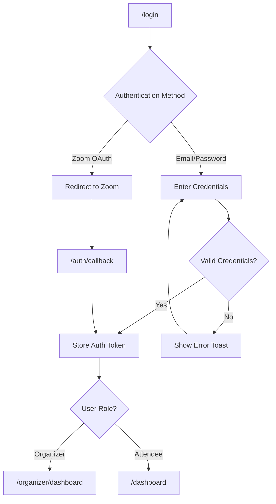

### Signup Flow
```mermaid
flowchart TD
    A["/signup"] --> B[Select Account Type]
    B -->|Attendee| C[Attendee Registration Form]
    B -->|Organizer| D[Organizer Registration Form]

    C --> E[Enter: Email, Name, Password]
    D --> F[Enter: Email, Name, Password]
    F --> G[Auto-enroll 30-day Professional Trial]

    E --> H[Accept Terms & Conditions]
    G --> H

    H --> I{Form Valid?}
    I -->|No| J[Show Validation Errors]
    J --> E

    I -->|Yes| K[Submit Registration]
    K --> L[Send Confirmation Email]
    L --> M[Redirect to "/login" with Success Message]

    subgraph "URL Parameters"
        N["?plan=pro|professional|starter"]
        O["?role=organizer"]
    end
```

### Password Recovery Flow
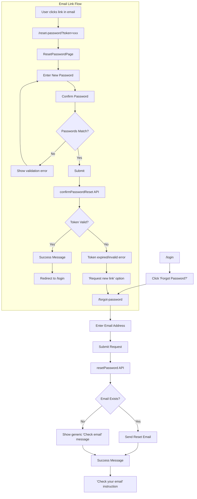

---

## 2. Onboarding Workflow

```mermaid
flowchart TD
    A[Organizer Signup Complete] --> B{Onboarding Completed?}
    B -->|No| C["/onboarding"]
    B -->|Yes| D["/organizer/dashboard"]

    C --> E["Step 1: Welcome"]
    E --> F["Display Trial Status: 30 days"]
    F --> G["Show Feature Limits"]
    G --> H[Click "Let's Get Started"]

    H --> I["Step 2: Profile Setup"]
    I --> J["Enter Full Name"]
    J --> K["Enter Organization Name"]
    K --> L[Click Next]

    L --> M["Step 3: Zoom Integration"]
    M --> N{Connect Zoom?}
    N -->|Yes| O["Redirect to Zoom OAuth"]
    O --> P["Store onboarding_redirect in sessionStorage"]
    P --> Q["Zoom Authorization"]
    Q --> R["Return to Onboarding Step 3"]
    N -->|Skip| S[Click Next/Skip]
    R --> S

    S --> T["Step 4: Billing Details"]
    T --> U["Display Plan: $30/mo"]
    U --> V["Show Trial Countdown"]
    V --> W{Add Payment Method?}
    W -->|Yes| X["Open PaymentMethodModal"]
    X --> Y["Enter Card Details via Stripe"]
    Y --> Z[Card Saved]
    W -->|Skip| AA[Click Skip]
    Z --> AA

    AA --> AB["Step 5: Complete"]
    AB --> AC["You're All Set!"]
    AC --> AD["Call refreshManifest()"]
    AD --> AE{Choose Action}
    AE -->|Create Event| AF["/events/create"]
    AE -->|Explore| AG["/dashboard"]
```

---

## 3. Event Creation Workflow

```mermaid
flowchart TD
    A["/events/create"] --> B["EventWizard Component"]

    B --> C["Step 1: Basic Info"]
    C --> C1["Event Title (required)"]
    C1 --> C2["Event Description (rich text)"]
    C2 --> C3["Event Type: webinar|workshop|course|conference"]
    C3 --> C4["Featured Image Upload"]
    C4 --> D[Next]

    D --> E["Step 2: Schedule"]
    E --> E1["Start Date & Time"]
    E1 --> E2["End Date & Time"]
    E2 --> E3["Timezone Selection"]
    E3 --> E4{Multi-Session?}
    E4 -->|Yes| E5["SessionEditor: Add/Edit Sessions"]
    E4 -->|No| F[Next]
    E5 --> F

    F --> G["Step 3: Details"]
    G --> G1["Format: Online|In-person|Hybrid"]
    G1 --> G2["Location (if applicable)"]
    G2 --> G3["CPD Credits: Value + Type"]
    G3 --> G4["Registration Deadline"]
    G4 --> G5["Max Attendees"]
    G5 --> G6["Learning Objectives"]
    G6 --> G7["Speakers Selection"]
    G7 --> G8["Custom Registration Fields"]
    G8 --> H[Next]

    H --> I["Step 4: Settings"]
    I --> I1["Registration Enabled Toggle"]
    I1 --> I2["Certificate Generation Toggle"]
    I2 --> I3["Certificate Template Selection"]
    I3 --> I4{Free Event?}
    I4 -->|No| I5["Set Price & Currency"]
    I4 -->|Yes| I6["Zoom Integration Options"]
    I5 --> I6
    I6 --> I7["Attendance Tracking Settings"]
    I7 --> J[Next]

    J --> K["Step 5: Review"]
    K --> K1["Summary of All Data"]
    K1 --> K2["Edit Buttons per Section"]
    K2 --> L{Submit}

    L --> M["Validate All Steps"]
    M --> N["Create Event via API"]
    N --> O["Upload Featured Image"]
    O --> P{Multi-Session?}
    P -->|Yes| Q["Create Sessions"]
    P -->|No| R["Success Toast"]
    Q --> R
    R --> S["Redirect to /events"]
```

### Edit Event Flow
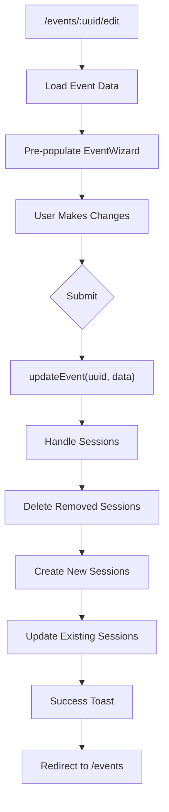

---

## 4. Event Registration Workflow

```mermaid
flowchart TD
    A["/events/:id/register"] --> B["Display Event Summary"]

    B --> C["Step 1: Registration Form"]
    C --> D["First Name (required)"]
    D --> E["Last Name (required)"]
    E --> F["Email (required)"]
    F --> G["Professional Title (optional)"]
    G --> H["Organization (optional)"]

    H --> I{Event is Paid?}
    I -->|Yes| I1["Show Promo Code Input"]
    I1 --> I2["Enter code + Apply button"]
    I2 --> I3{Code Valid?}
    I3 -->|Yes| I4["Show discount applied"]
    I3 -->|No| I5["Show error message"]
    I4 --> J
    I5 --> I2
    I -->|No| J

    J --> K["Custom Fields from Event"]

    K --> L{User Authenticated?}
    L -->|No| M["Show 'Create Account' Checkbox"]
    M --> N{Checkbox Checked?}
    N -->|Yes| O["Show Password Field"]
    N -->|No| P[Continue]
    O --> P
    L -->|Yes| P

    P --> Q["Submit Registration"]
    Q --> R["registerForEvent API Call"]
    R --> R1["Include promo_code if applied"]

    R1 --> S{requires_payment?}
    S -->|No - Free or 100% Discount| T["Step 3: Success"]
    S -->|Yes - Paid Event| U["Step 2: Payment"]

    U --> V["Display Stripe PaymentForm"]
    V --> V1["Show discounted amount if promo applied"]
    V1 --> W["Enter Card Details"]
    W --> X["Process Payment"]
    X --> Y{Payment Successful?}
    Y -->|Yes| Z["handlePaymentSuccess()"]
    Y -->|No| AA["Show Error, Retry"]
    AA --> W

    Z --> AB{Create Account Requested?}
    AB -->|Yes| AC["Create User Account"]
    AB -->|No| T
    AC --> T

    T --> AD["Green Checkmark"]
    AD --> AE["'You're Registered!' Message"]
    AE --> AF["Check Email for Confirmation"]
    AF --> AG{User Choice}
    AG -->|View Event| AH["/events/:slug"]
    AG -->|Browse More| AI["/events/browse"]
```

---

## 5. Promo Code Workflow

### Attendee: Applying Promo Code During Registration
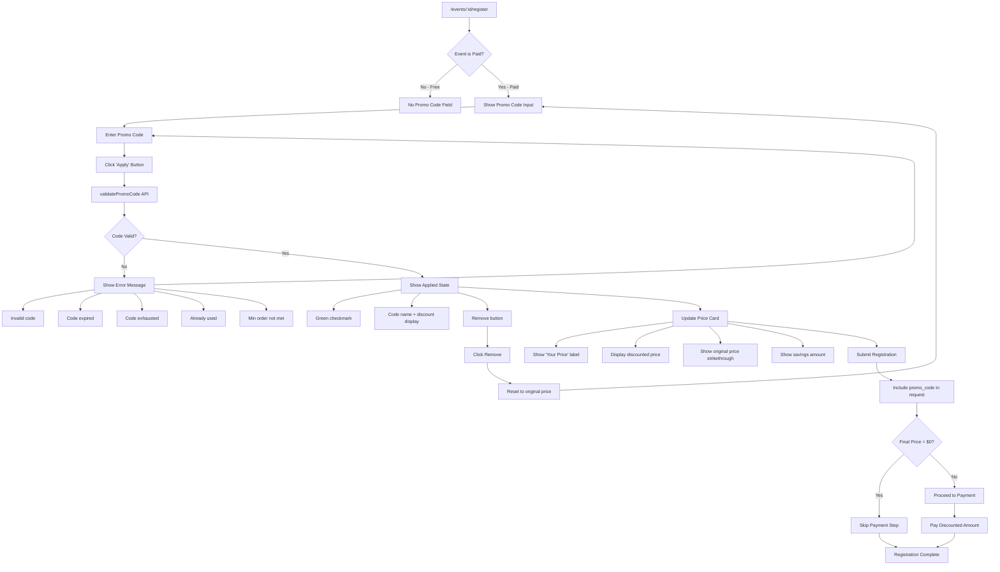

### Organizer: Managing Promo Codes
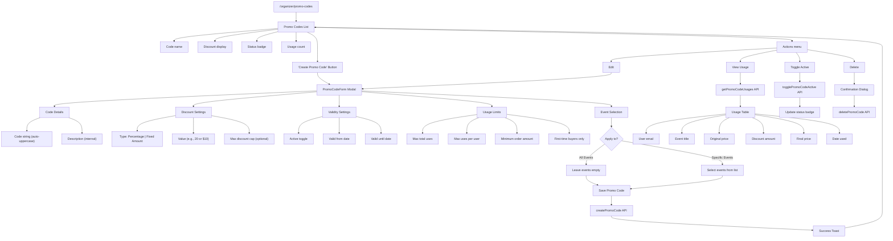

---

## 6. Organizer Dashboard Workflows

### Main Dashboard
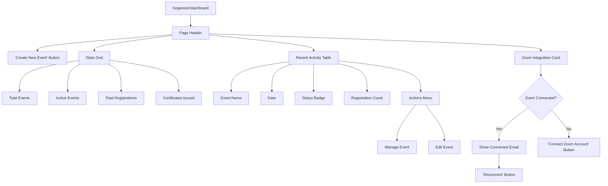

### Event Management
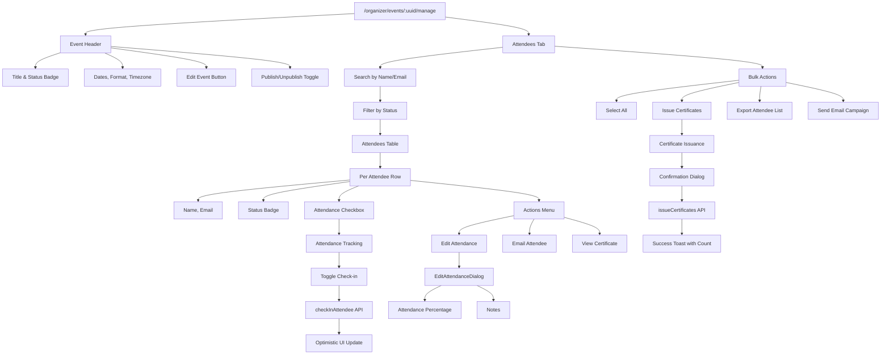

---

## 6. Attendee Dashboard Workflows

### Main Dashboard
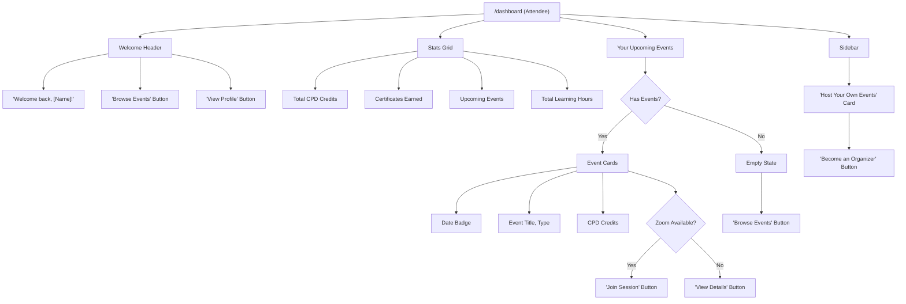

### My Registrations
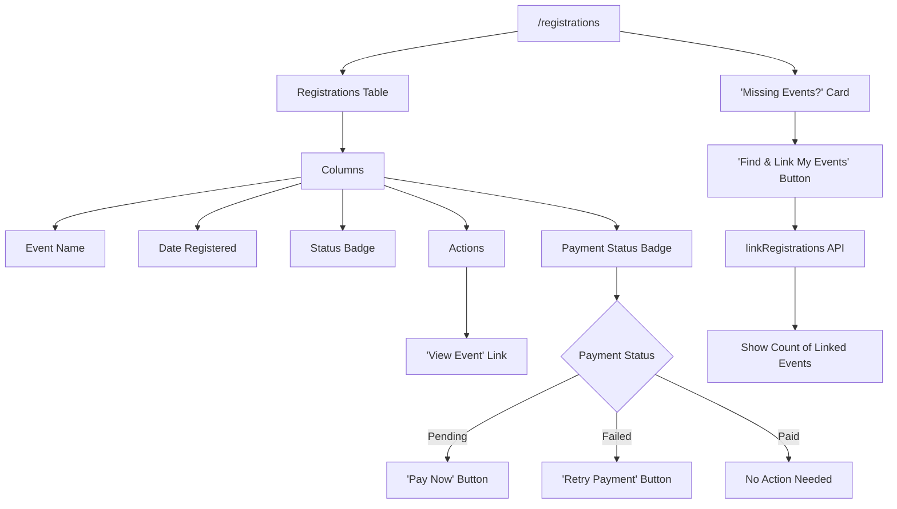

### My Certificates
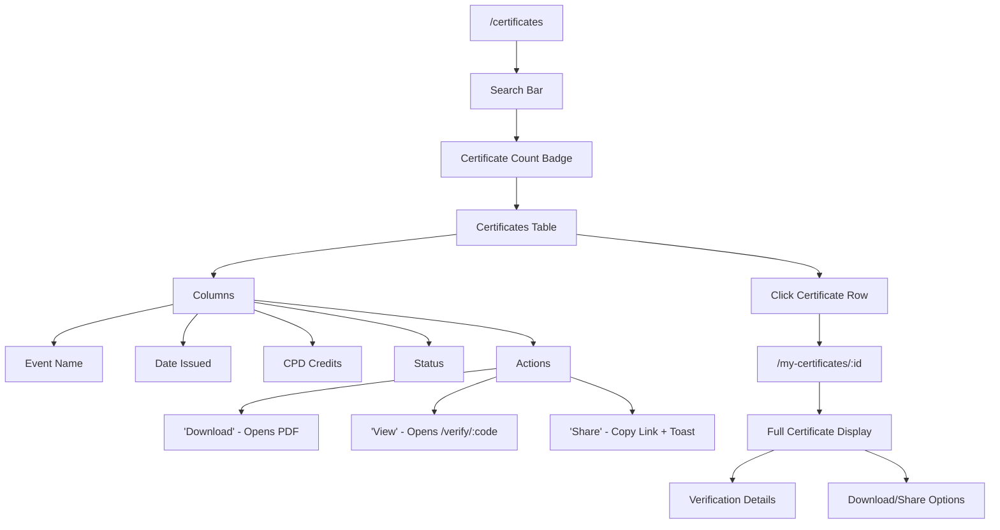

---

## 8. Feedback Collection Workflow

### Attendee: Leaving Feedback
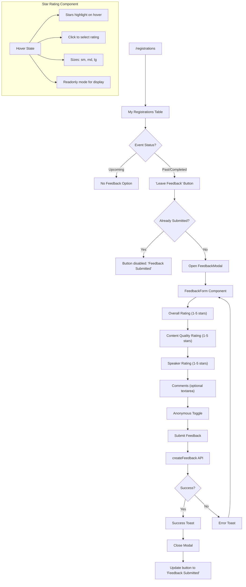

### Organizer: Viewing Event Feedback
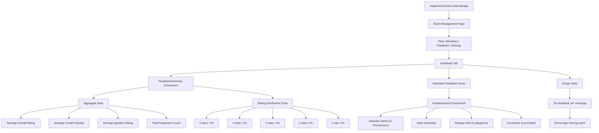

---

## 9. Billing & Subscription Workflow

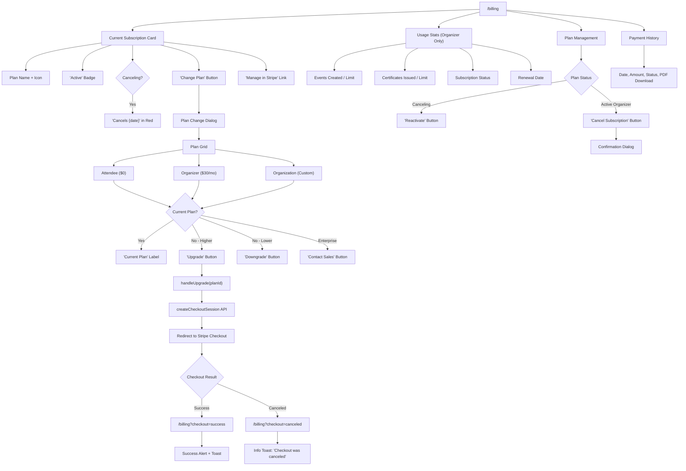

---

## 8. Profile & Settings Workflows

### Profile Page
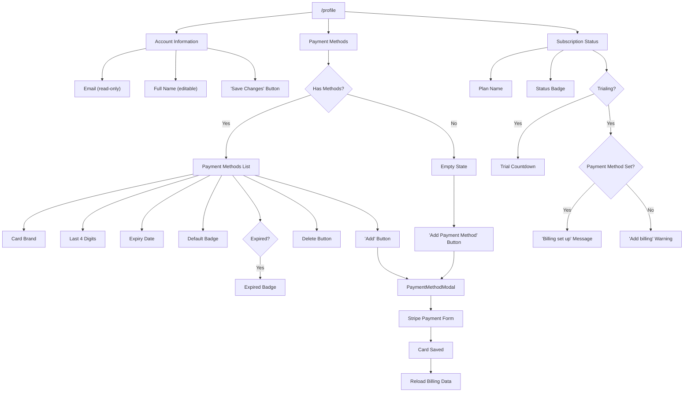

---

## 10. Subscription Cancellation with Retention

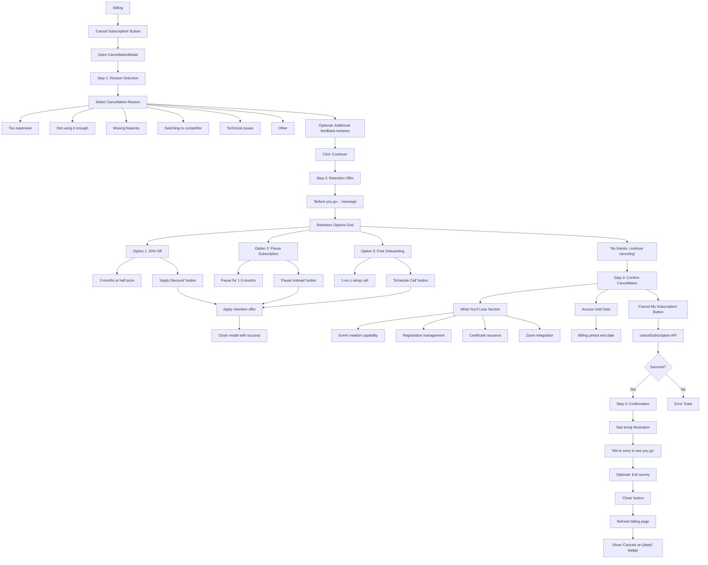

---

## 11. Profile & Settings Workflows

### Profile Page
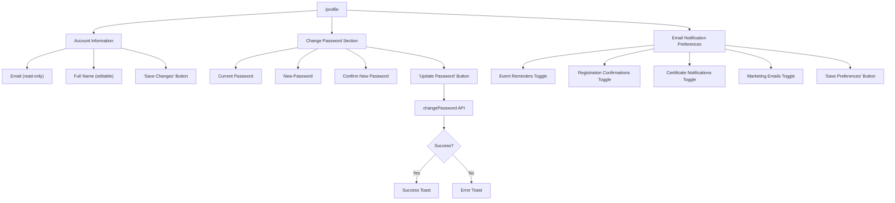

### Payment Methods
```mermaid
flowchart TD
    A["/profile"] --> B["Payment Methods"]
    B --> C{Has Methods?}
    C -->|Yes| D["Payment Methods List"]
    D --> D1["Card Brand"]
    D --> D2["Last 4 Digits"]
    D --> D3["Expiry Date"]
    D --> D4["Default Badge"]
    D --> D5{Expired?}
    D5 -->|Yes| D6["Expired Badge"]
    D --> D7["Delete Button"]
    D --> D8["'Add' Button"]

    C -->|No| E["Empty State"]
    E --> E1["'Add Payment Method' Button"]

    D8 --> F["PaymentMethodModal"]
    E1 --> F
    F --> G["Stripe Payment Form"]
    G --> H["Card Saved"]
    H --> I["Reload Billing Data"]

    A --> J["Subscription Status"]
    J --> J1["Plan Name"]
    J --> J2["Status Badge"]
    J --> J3{Trialing?}
    J3 -->|Yes| J4["Trial Countdown"]
    J3 -->|Yes| J5{Payment Method Set?}
    J5 -->|Yes| J6["'Billing set up' Message"]
    J5 -->|No| J7["'Add billing' Warning"]
```

---

## 12. Organization Management Workflow

### Organization Creation
```mermaid
flowchart TD
    A["/organizations"] --> B["Organizations List"]
    B --> C["'Create Organization' Button"]
    C --> D["/organizations/new"]

    D --> E{URL Params?}
    E -->|"?from=account"| F["Upgrade Mode"]
    E -->|None| G["Fresh Creation Mode"]

    F --> H["Show Transfer Notice"]
    H --> H1["X Events"]
    H --> H2["Y Certificate Templates"]
    H --> I["getLinkableDataPreview API"]

    G --> J["Organization Form"]
    F --> J
    J --> J1["Organization Name (required)"]
    J --> J2["Description (rich text)"]
    J --> J3["Website URL"]
    J --> J4["Contact Email"]

    J --> K{Upgrade Mode?}
    K -->|Yes| L["createOrgFromAccount API"]
    L --> L1["transfer_data: true"]
    K -->|No| M["createOrganization API"]

    L1 --> N["Success Screen"]
    M --> N
    N --> N1["Green Checkmark"]
    N --> N2["'Organization Created!'"]
    N --> O["Redirect to /org/:slug"]
```

### Organization Dashboard
```mermaid
flowchart TD
    A["/org/:slug"] --> B["Organization Overview"]
    B --> B1["Org Name & Logo"]
    B --> B2["Members Count"]
    B --> B3["Events List"]
    B --> B4["Invitation Link"]
    B --> B5["Settings Button"]

    B5 --> C["/org/:slug/settings"]
    C --> C1["Organization Name"]
    C --> C2["Description"]
    C --> C3["Logo Upload"]
    C --> C4["Website URL"]
    C --> C5["Contact Info"]
    C --> C6["Stripe Connect Integration"]
    C --> C7["Billing Settings"]

    A --> D["Team Management Link"]
    D --> E["/org/:slug/team"]
    E --> E1["Team Members List"]
    E --> E2["Roles: Admin, Manager, Organizer"]
    E --> E3["Add Member by Email"]
    E --> E4["Remove Member"]
    E --> E5["Update Member Role"]

    A --> F["Courses Link"]
    F --> G["/org/:slug/courses"]
    G --> G1["Courses List"]
    G --> G2["'Create Course' Button"]
    G2 --> H["/org/:slug/courses/new"]
    H --> H1["Course Form"]
    H --> H2["Curriculum Builder"]
    H --> H3["Lessons/Modules Editor"]
```

---

## 13. Zoom Integration Workflow

```mermaid
flowchart TD
    A["Organizer Dashboard or Onboarding"] --> B["'Connect Zoom Account' Button"]
    B --> C["initiateZoomOAuth API"]
    C --> D["Get OAuth URL"]
    D --> E["Redirect to Zoom Login"]
    E --> F["User Authorizes App"]
    F --> G["/zoom/callback"]
    G --> H["Backend Creates ZoomIntegration"]

    H --> I{Check sessionStorage}
    I -->|"onboarding_redirect" exists| J["Return to Onboarding Step 3"]
    I -->|None| K["Redirect to /organizer/dashboard"]

    K --> L["Zoom Card Updated"]
    L --> L1["Connected Email Shown"]
    L --> L2["Animated Pulse Indicator"]
    L --> L3["'Disconnect' Button"]
    L --> L4["Meeting Count"]

    L3 --> M["disconnectZoom API"]
    M --> N["Status Reset to Disconnected"]

    subgraph "Auto-Meeting Creation"
        O["Event Creation - Step 4"]
        O --> P["'Auto-create Zoom' Checkbox"]
        P --> Q{Zoom Connected?}
        Q -->|Yes| R["Meeting Created on Save"]
        R --> S["zoom_join_url Stored"]
    end

    subgraph "Attendee Join"
        T["Attendee Dashboard"]
        T --> U["'Join Session' Button"]
        U --> V{Can Join?}
        V -->|Yes| W["Open zoom_join_url"]
        V -->|No - Not Started| X["Button Disabled"]
        V -->|No - No URL| X
    end
```

---

## 14. Certificate Verification Workflow

```mermaid
flowchart TD
    A["Public URL: /verify/:code"] --> B["No Auth Required"]
    B --> C["Fetch Certificate by Short Code"]
    C --> D{Certificate Found?}

    D -->|Yes| E["Display Certificate Details"]
    E --> E1["Recipient Name"]
    E --> E2["Event Title"]
    E --> E3["Date Issued"]
    E --> E4["CPD Credits"]
    E --> E5["Organizer Name"]
    E --> E6["Verification Status: ✓ Valid"]
    E --> E7["QR Code (optional)"]
    E --> F["'Download PDF' Button"]

    D -->|No| G["Certificate Not Found Error"]
```

---

## 15. Event Duplication Workflow

```mermaid
flowchart TD
    A["/events"] --> B["Events List Page"]
    B --> C["Event Row"]
    C --> D["Actions Dropdown Menu"]

    D --> E["View"]
    E --> F["/events/:slug"]

    D --> G["Edit"]
    G --> H["/events/:uuid/edit"]

    D --> I["Duplicate"]
    I --> J["Show Loading Spinner"]
    J --> K["duplicateEvent API"]

    K --> L{Success?}
    L -->|Yes| M["Success Toast: 'Event duplicated!'"]
    M --> N["Navigate to /events/:newUuid/edit"]
    N --> O["Pre-populated Event Wizard"]
    O --> O1["Title: 'Copy of [Original]'"]
    O --> O2["All settings copied"]
    O --> O3["Dates cleared (user must set)"]
    O --> O4["Status: Draft"]

    L -->|No| P["Error Toast"]
    P --> B

    D --> Q["Delete"]
    Q --> R["Open Confirmation Dialog"]
    R --> S["'Are you sure?' message"]
    S --> S1["Event title displayed"]
    S --> S2["Warning about registrations"]

    R --> T{User Choice}
    T -->|Cancel| U["Close Dialog"]
    T -->|Confirm Delete| V["deleteEvent API"]
    V --> W{Success?}
    W -->|Yes| X["Success Toast"]
    X --> Y["Remove from list"]
    W -->|No| Z["Error Toast"]
```

---

## 16. Complete Application Flow

```mermaid
flowchart TD
    subgraph "Public Access"
        A[Landing Page "/"] --> B[Event Discovery "/events/browse"]
        B --> C[Event Detail "/events/:id"]
        C --> D[Event Registration "/events/:id/register"]
        A --> E[Pricing "/pricing"]
        A --> F[Features "/features"]
        A --> G[Certificate Verify "/verify/:code"]
    end

    subgraph "Authentication"
        H[Login "/login"] --> I{Auth Success?}
        I -->|Yes| J{User Role?}
        I -->|No| H

        K[Signup "/signup"] --> L{Account Type?}
        L -->|Attendee| M[Create Attendee Account]
        L -->|Organizer| N[Create Organizer + Trial]
        M --> H
        N --> H
    end

    subgraph "Organizer Flow"
        J -->|Organizer| O{Onboarding Complete?}
        O -->|No| P[Onboarding Wizard]
        P --> Q[Organizer Dashboard]
        O -->|Yes| Q

        Q --> R[Create Event]
        Q --> S[Manage Events]
        Q --> T[Contacts]
        Q --> U[Reports]
        Q --> V[Certificates]
        Q --> W[Zoom Integration]
        Q --> X[Billing]
        Q --> Y[Organization Management]
    end

    subgraph "Attendee Flow"
        J -->|Attendee| Z[Attendee Dashboard]
        Z --> AA[My Registrations]
        Z --> AB[My Certificates]
        Z --> AC[CPD Tracking]
        Z --> AD[My Events]
        Z --> AE[Browse Events]
        Z --> AF[Profile]
    end

    subgraph "Shared"
        Q --> AG[Profile/Settings]
        Z --> AG
    end
```

---

## Navigation Structure

```mermaid
flowchart LR
    subgraph "Public Layout"
        A[Public Navigation]
        A --> A1[Home]
        A --> A2[Events]
        A --> A3[Pricing]
        A --> A4[Features]
        A --> A5[Login/Signup]
    end

    subgraph "Dashboard Layout - Organizer"
        B[Sidebar]
        B --> B1[Dashboard]
        B --> B2[Events]
        B --> B3[Contacts]
        B --> B4[Certificates]
        B --> B5[Reports]
        B --> B6[Billing]
        B --> B7[Settings]
        B --> B8[Organization]
    end

    subgraph "Dashboard Layout - Attendee"
        C[Sidebar]
        C --> C1[Dashboard]
        C --> C2[My Events]
        C --> C3[My Courses]
        C --> C4[CPD Tracking]
        C --> C5[Certificates]
        C --> C6[Registrations]
        C --> C7[Profile]
    end
```

---

## Route Protection

```mermaid
flowchart TD
    A[User Requests Route] --> B{Route Type?}

    B -->|Public| C[Allow Access]
    C --> D[Render with PublicLayout]

    B -->|Auth Pages| E{Already Logged In?}
    E -->|Yes| F[Redirect to Dashboard]
    E -->|No| G[Render with AuthLayout]

    B -->|Protected| H{Authenticated?}
    H -->|No| I[Redirect to Login]
    H -->|Yes| J{Role Check?}
    J -->|Pass| K[Render with DashboardLayout]
    J -->|Fail| L[Redirect to Appropriate Dashboard]

    subgraph "Public Routes"
        M1["/"]
        M2["/events/browse"]
        M3["/events/:id"]
        M4["/pricing"]
        M5["/verify/:code"]
    end

    subgraph "Auth Routes"
        N1["/login"]
        N2["/signup"]
        N3["/forgot-password"]
    end

    subgraph "Protected Routes"
        O1["/dashboard"]
        O2["/organizer/*"]
        O3["/events/create"]
        O4["/billing"]
        O5["/profile"]
    end
```
