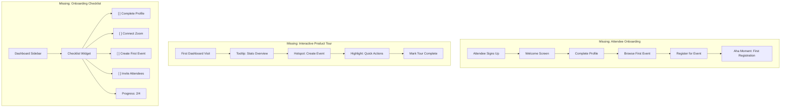
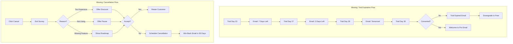
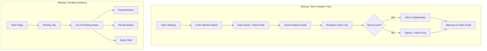
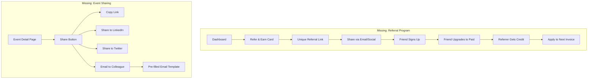
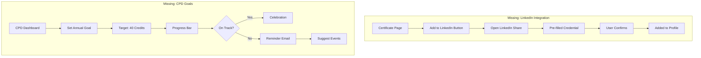
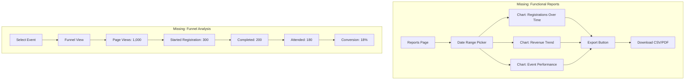

```mermaid
flowchart TD
    subgraph "Missing: Email Verification Flow"
        A[User Signs Up] --> B[Send Verification Email]
        B --> C[User Clicks Link]
        C --> D[Email Verified Badge]
        D --> E[Full Access Granted]
    end

    subgraph "Missing: Password Change Flow"
        F[Settings Page] --> G[Current Password]
        G --> H[New Password]
        H --> I[Confirm New Password]
        I --> J[Password Updated]
    end

    subgraph "Missing: Account Deletion Flow"
        K[Settings] --> L[Request Deletion]
        L --> M[Confirm with Password]
        M --> N[30-day Grace Period]
        N --> O[Data Export Option]
        O --> P[Account Deleted]
    end
```

```mermaid
flowchart TD
    subgraph "Missing: Contextual Help"
        A[Complex Feature] --> B[Help Icon]
        B --> C[Tooltip with Explanation]
        C --> D[Link to Full Documentation]
        D --> E[Still Stuck?]
        E --> F[Contact Support Button]
    end

    subgraph "Missing: Support Ticket Flow"
        G[Help Menu] --> H[Submit Ticket]
        H --> I[Select Category]
        I --> J[Describe Issue]
        J --> K[Attach Screenshots]
        K --> L[Submit]
        L --> M[Ticket Created Email]
        M --> N[Track Status in App]
        N --> O[Resolution + Rating]
    end
```

```mermaid
flowchart TD
    subgraph "Missing: Event Duplication"
        A[Event Actions Menu] --> B[Duplicate Event]
        B --> C[Copy All Settings]
        C --> D[Clear Date/Time]
        D --> E[Open in Edit Mode]
        E --> F[Adjust Details]
        F --> G[Publish as New Event]
    end

    subgraph "Missing: Recurring Events"
        H[Event Settings] --> I[Recurring Toggle]
        I --> J[Frequency: Weekly/Monthly]
        J --> K[Repeat Until Date]
        K --> L[Generate All Instances]
        L --> M[Linked Event Series]
        M --> N[Edit Single or All]
    end

    subgraph "Missing: Waitlist Flow"
        O[Event Full] --> P[Join Waitlist Button]
        P --> Q[Waitlist Confirmation]
        Q --> R[Attendee Cancels]
        R --> S[Auto-promote from Waitlist]
        S --> T[Notification to New Attendee]
    end
```

```mermaid
flowchart TD
    subgraph "Missing: Promo Code Flow"
        A[Registration Form] --> B[Have Promo Code?]
        B --> C[Enter Code Field]
        C --> D[Apply Button]
        D --> E{Valid?}
        E -->|Yes| F[Show Discount]
        E -->|No| G[Error Message]
        F --> H[Updated Total]
    end

    subgraph "Missing: Group Registration"
        I[Event Page] --> J[Register Group Button]
        J --> K[Number of Attendees]
        K --> L[Attendee 1 Details]
        L --> M[Attendee 2 Details]
        M --> N[...]
        N --> O[Single Payment]
        O --> P[Individual Confirmations]
    end

    subgraph "Missing: Refund Request"
        Q[My Registrations] --> R[Request Refund]
        R --> S[Select Reason]
        S --> T[Confirm Request]
        T --> U{Within Policy?}
        U -->|Yes| V[Auto-Approve]
        U -->|No| W[Pending Review]
        V --> X[Refund Processed]
        W --> Y[Admin Decision]
    end
```

# CPD Events - UI/UX Workflow Gap Analysis

## Executive Summary

This document provides a comprehensive analysis of the CPD Events platform's user workflows compared against industry best practices for SaaS applications in 2024-2025. The analysis identifies gaps, missing flows, and improvement opportunities based on research from leading SaaS UX resources.

---

## Research Sources

- [Mouseflow - SaaS UX Design Best Practices 2025](https://mouseflow.com/blog/saas-ux-design-best-practices/)
- [UserPilot - SaaS Free Trial Best Practices](https://userpilot.com/blog/saas-free-trial-best-practices/)
- [Arounda - User Onboarding Design Best Practices](https://arounda.agency/blog/user-onboarding-design-best-practices-guide-with-examples)
- [UserPilot - Churn Prevention Strategies](https://userpilot.com/blog/churn-prevention-saas/)
- [Dan Siepen - SaaS Referral Program Strategies](https://www.dansiepen.io/growth-checklists/saas-referral-program-strategies-optimisations)
- [MailChannels - Transactional Email Guide](https://blog.mailchannels.com/the-essential-guide-to-transactional-emails-for-saas-companies/)

---

## Gap Analysis by Category

### 1. AUTHENTICATION & ACCOUNT MANAGEMENT

#### Current State
- Login with email/password
- Zoom OAuth integration
- Signup with role selection (Attendee/Organizer)
- Forgot password page (UI only, no backend integration)

#### Gaps Identified

| Gap | Priority | Industry Standard | Impact |
|-----|----------|-------------------|--------|
| **Password Reset Not Functional** | Critical | Fully functional password reset with email verification | Users cannot recover accounts |
| **No Email Verification** | High | Email verification on signup to confirm identity | Security risk, fake accounts |
| **No Magic Link Login** | Medium | Passwordless login option for convenience | 23% of users prefer passwordless |
| **No Social Login Options** | Medium | Google/Microsoft/LinkedIn OAuth | Reduces signup friction by 50% |
| **No Account Deletion Flow** | High | GDPR-compliant account deletion with data export | Legal compliance issue |
| **No Change Password Flow** | High | Ability to change password from settings | Basic security feature |
| **No Two-Factor Authentication (2FA)** | Medium | 2FA for enhanced security | Security best practice |
| **No Session Management** | Low | View/revoke active sessions | Security transparency |

#### Missing Workflows



---

### 2. ONBOARDING EXPERIENCE

#### Current State
- 5-step onboarding wizard for organizers
- Profile setup, Zoom integration, billing
- Welcome step with feature highlights
- Progress bar indicator

#### Gaps Identified

| Gap | Priority | Industry Standard | Impact |
|-----|----------|-------------------|--------|
| **No Attendee Onboarding** | High | Role-specific onboarding for all user types | 72% abandon apps with poor onboarding |
| **No "Aha Moment" Tracking** | High | Track when users reach first value | Critical for conversion |
| **No Interactive Product Tour** | High | Tooltips, hotspots for feature discovery | Improves feature adoption by 40% |
| **No Onboarding Checklist** | High | Persistent checklist showing progress | Gamification increases completion |
| **No Personalization Questions** | Medium | Ask goals/use case during onboarding | 81% prefer personalized experiences |
| **No Skip + Resume Later** | Medium | Allow partial completion with reminders | Reduces drop-off |
| **No Onboarding Analytics** | Medium | Track completion rates per step | Data for optimization |
| **No Welcome Email Sequence** | High | Drip campaign post-signup | Increases activation by 50% |

#### Missing Workflows



---

### 3. TRIAL & CONVERSION OPTIMIZATION

#### Current State
- 30-day professional trial for organizers
- Trial status shown in onboarding
- Billing page with plan comparison
- Stripe checkout integration

#### Gaps Identified

| Gap | Priority | Industry Standard | Impact |
|-----|----------|-------------------|--------|
| **No Trial Expiration Reminders** | Critical | Email sequence at 7, 3, 1 days before expiry | Prevents silent churn |
| **No In-App Trial Banner** | High | Persistent banner showing days remaining | Creates urgency |
| **No Usage-Based Nudges** | High | "You've used 80% of your limit" alerts | Drives upgrades |
| **No Trial Extension Offers** | Medium | Offer extension for engaged users | Increases conversion |
| **No Exit Intent Detection** | Medium | Detect when users might churn | Proactive intervention |
| **No Downgrade Prevention Flow** | High | Retention offer when canceling | Reduces churn by 15-30% |
| **No Win-Back Campaigns** | Medium | Re-engagement for expired trials | Recovers 5-10% of churned |

#### Missing Workflows



---

### 4. USER ENGAGEMENT & RETENTION

#### Current State
- Basic notification system (mock data, not real-time)
- Dashboard with stats
- No engagement tracking

#### Gaps Identified

| Gap | Priority | Industry Standard | Impact |
|-----|----------|-------------------|--------|
| **Notifications Not Functional** | Critical | Real-time notifications via WebSocket/polling | Core feature missing |
| **No Email Notifications Settings** | High | User preferences for email frequency | Prevents email fatigue |
| **No In-App Announcements** | Medium | Feature announcements, updates, tips | Increases feature adoption |
| **No Activity Feed** | Medium | Timeline of user actions | Engagement visibility |
| **No Inactivity Detection** | High | Detect dormant users, send re-engagement | Prevents churn |
| **No Push Notifications** | Low | Browser push for time-sensitive events | Real-time engagement |
| **No NPS/Feedback Collection** | High | In-app surveys at key moments | Product improvement data |
| **No Milestone Celebrations** | Low | Celebrate achievements (10th event, etc.) | Emotional engagement |

#### Missing Workflows

```mermaid
flowchart TD
    subgraph "Missing: Notification Preferences"
        A[Settings] --> B[Email Notifications]
        B --> C["[ ] Event Reminders"]
        B --> D["[ ] Certificate Issued"]
        B --> E["[ ] New Registration"]
        B --> F["[ ] Weekly Summary"]
        B --> G[Frequency: Instant/Daily/Weekly]
    end

    subgraph "Missing: Re-engagement Flow"
        H[User Inactive 7 Days] --> I[Trigger Alert]
        I --> J[Send "We Miss You" Email]
        J --> K[User Inactive 14 Days]
        K --> L[Send "Here's What's New"]
        L --> M[User Inactive 30 Days]
        M --> N[At-Risk Flag for CS Team]
    end

    subgraph "Missing: Feedback Collection"
        O[User Completes Event] --> P[Wait 24 Hours]
        P --> Q[Show NPS Survey]
        Q --> R{Score}
        R -->|9-10| S[Ask for Review/Referral]
        R -->|7-8| T[Ask for Improvement Ideas]
        R -->|0-6| U[Trigger Support Outreach]
    end
```

---

### 5. TEAM & COLLABORATION FEATURES

#### Current State
- Organization structure exists
- Team management page for organizations
- Basic role assignment

#### Gaps Identified

| Gap | Priority | Industry Standard | Impact |
|-----|----------|-------------------|--------|
| **No Team Invitation Flow** | High | Email invites with role assignment | Team growth blocker |
| **No Pending Invitations View** | Medium | See and resend pending invites | Visibility issue |
| **No Role-Based Permissions UI** | Medium | Clear permission matrix | Confusion about access |
| **No Team Activity Log** | Low | See what team members did | Accountability |
| **No Seat Management** | Medium | Add/remove seats with billing impact | Enterprise need |
| **No Team Onboarding** | Medium | Onboard invited team members | Consistent experience |

#### Missing Workflows



---

### 6. REFERRAL & GROWTH FEATURES

#### Current State
- No referral system
- No affiliate program
- No social sharing

#### Gaps Identified

| Gap | Priority | Industry Standard | Impact |
|-----|----------|-------------------|--------|
| **No Referral Program** | High | Refer-a-friend with rewards | Viral growth driver |
| **No Event Sharing Tools** | Medium | Social share buttons for events | Event discovery |
| **No Affiliate/Partner Portal** | Low | Partner program for resellers | B2B growth channel |
| **No Testimonial Collection** | Medium | Request reviews from happy users | Social proof |
| **No Case Study Workflow** | Low | Identify and feature successful users | Marketing content |

#### Missing Workflows



---

### 7. HELP & SUPPORT SYSTEMS

#### Current State
- FAQ page (static)
- Contact page
- No in-app help

#### Gaps Identified

| Gap | Priority | Industry Standard | Impact |
|-----|----------|-------------------|--------|
| **No Help Center/Knowledge Base** | High | Searchable documentation | Reduces support tickets |
| **No Contextual Help** | High | Help icons/tooltips on complex features | Reduces confusion |
| **No Live Chat Widget** | Medium | Real-time support for paying users | Faster resolution |
| **No Support Ticket System** | High | Track and manage support requests | Support scalability |
| **No Video Tutorials** | Medium | How-to videos for key workflows | Visual learners |
| **No Status Page** | Medium | System status and incidents | Transparency |
| **No Chatbot/AI Assistant** | Low | AI-powered first-line support | 24/7 availability |

#### Missing Workflows



---

### 8. EVENT MANAGEMENT GAPS

#### Current State
- 5-step event creation wizard
- Multi-session support
- Zoom integration
- Registration management

#### Gaps Identified

| Gap | Priority | Industry Standard | Impact |
|-----|----------|-------------------|--------|
| **No Event Duplication** | High | Clone existing events | Time-saver for recurring events |
| **No Event Templates** | High | Save and reuse event configurations | Efficiency improvement |
| **No Recurring Events** | High | Set up weekly/monthly series | Common use case |
| **No Draft Auto-Save** | High | Automatically save work in progress | Prevents data loss |
| **No Event Preview** | Medium | Preview public event page before publishing | Quality assurance |
| **No Waitlist Management** | Medium | Automatic waitlist when full | Maximize attendance |
| **No Event Analytics Dashboard** | High | Detailed per-event insights | Data-driven decisions |
| **No Bulk Actions** | Medium | Archive, delete, publish multiple events | Efficiency at scale |
| **No Event Calendar View** | Medium | Visual calendar of all events | Better planning |

#### Missing Workflows



---

### 9. REGISTRATION & PAYMENT GAPS

#### Current State
- Registration form with custom fields
- Stripe payment integration
- Guest registration (no account)

#### Gaps Identified

| Gap | Priority | Industry Standard | Impact |
|-----|----------|-------------------|--------|
| **No Group Registration** | Medium | Register multiple attendees at once | B2B convenience |
| **No Discount/Promo Codes** | High | Promotional pricing | Marketing tool |
| **No Early Bird Pricing** | Medium | Time-based pricing tiers | Incentivizes early signup |
| **No Refund Self-Service** | Medium | Request/process refunds | Reduces support load |
| **No Payment Plans** | Low | Split payments for expensive events | Accessibility |
| **No Invoice Generation** | Medium | Generate invoices for organizations | B2B requirement |
| **No Registration Transfer** | Low | Transfer ticket to another person | Flexibility |
| **No Attendance Confirmation** | Medium | Confirm you'll attend vs. registered | Accurate headcount |

#### Missing Workflows



---

### 10. CERTIFICATE & CPD GAPS

#### Current State
- Certificate generation
- Public verification page
- CPD tracking for attendees

#### Gaps Identified

| Gap | Priority | Industry Standard | Impact |
|-----|----------|-------------------|--------|
| **No Certificate Customization UI** | High | Drag-drop template builder | Design flexibility |
| **No Bulk Certificate Issuance** | High | Issue to all attended at once | Time-saver |
| **No Certificate Revocation** | Medium | Revoke issued certificates | Error correction |
| **No Certificate Expiry** | Low | Certificates that expire | Recertification |
| **No LinkedIn Integration** | Medium | Add certificate to LinkedIn profile | Professional visibility |
| **No CPD Goal Setting** | Medium | Set annual CPD targets | Motivation |
| **No CPD Reminders** | Low | Remind when behind on CPD goals | Engagement |
| **No External CPD Import** | Low | Import credits from other sources | Complete tracking |

#### Missing Workflows



---

### 11. MOBILE & ACCESSIBILITY GAPS

#### Current State
- Responsive design (assumed)
- No native mobile app
- Basic accessibility (assumed)

#### Gaps Identified

| Gap | Priority | Industry Standard | Impact |
|-----|----------|-------------------|--------|
| **No Mobile-Optimized Event Check-in** | High | QR code scanning for attendance | Event day efficiency |
| **No PWA Support** | Medium | Installable web app | Mobile-like experience |
| **No Offline Mode** | Low | View events/certificates offline | Connectivity issues |
| **No Accessibility Audit** | High | WCAG 2.1 AA compliance | Legal/ethical requirement |
| **No Keyboard Navigation Testing** | Medium | Full keyboard accessibility | Power users, accessibility |
| **No Screen Reader Optimization** | Medium | Proper ARIA labels | Accessibility |

---

### 12. ANALYTICS & REPORTING GAPS

#### Current State
- Basic reports page (placeholder charts)
- Stats on dashboard
- No real analytics

#### Gaps Identified

| Gap | Priority | Industry Standard | Impact |
|-----|----------|-------------------|--------|
| **Reports Are Non-Functional** | Critical | Actual data-driven reports | Core business need |
| **No Date Range Filtering** | High | Custom date selection | Flexible analysis |
| **No Export to CSV/PDF** | High | Download reports | Offline analysis, compliance |
| **No Registration Funnel Analysis** | Medium | Track conversion rates | Optimization insights |
| **No Attendee Demographics** | Medium | Understand your audience | Targeting |
| **No Revenue Reports** | High | Track earnings over time | Financial visibility |
| **No Comparison Reports** | Low | Compare events/periods | Trend analysis |
| **No Scheduled Reports** | Low | Automated email reports | Convenience |

#### Missing Workflows



---

## Priority Matrix

### Critical (Must Fix Immediately)
1. Password reset functionality (non-functional)
2. Notifications system (using mock data)
3. Reports/analytics (placeholder only)
4. Trial expiration email reminders
5. Email verification on signup

### High Priority (Next Sprint)
1. Interactive onboarding tour
2. Onboarding checklist
3. Attendee onboarding flow
4. Event duplication feature
5. Event templates
6. Recurring events
7. Promo/discount codes
8. Team invitation workflow
9. In-app trial countdown banner
10. Email notification preferences

### Medium Priority (Next Quarter)
1. Account deletion flow
2. Magic link login
3. Social login (Google)
4. Help center/knowledge base
5. Contextual help tooltips
6. Event preview before publish
7. Waitlist management
8. Group registration
9. LinkedIn certificate sharing
10. NPS/feedback collection

### Low Priority (Future Consideration)
1. Two-factor authentication
2. Push notifications
3. PWA support
4. Session management
5. Chatbot support
6. Certificate expiry
7. Comparison reports

---

## Implementation Recommendations

### Phase 1: Critical Fixes (1-2 weeks)
1. Implement actual password reset API integration
2. Connect notifications to real backend/WebSocket
3. Build real reporting with actual data
4. Set up trial expiration email triggers
5. Add email verification flow

### Phase 2: Activation & Conversion (3-4 weeks)
1. Build interactive product tour (use Shepherd.js or Intro.js)
2. Create persistent onboarding checklist component
3. Design attendee-specific onboarding
4. Implement event duplication and templates
5. Add promo code system

### Phase 3: Engagement & Retention (4-6 weeks)
1. Email preference center
2. Cancellation flow with retention offers
3. Team invitation workflow
4. Referral program
5. In-app help system

### Phase 4: Scale & Polish (6-8 weeks)
1. Advanced analytics
2. Mobile optimization
3. Accessibility audit and fixes
4. LinkedIn integration
5. Group registration

---

## Success Metrics to Track

| Metric | Current (Estimated) | Target | Industry Benchmark |
|--------|---------------------|--------|-------------------|
| Trial-to-Paid Conversion | Unknown | 20% | 15-25% |
| Onboarding Completion | Unknown | 80% | 60-80% |
| Feature Activation (Event Created) | Unknown | 50% in Week 1 | 40-60% |
| Monthly Churn Rate | Unknown | <5% | 3-7% |
| NPS Score | Unknown | >50 | 30-50 |
| Support Ticket Resolution | Unknown | <24 hours | 24-48 hours |

---

## Conclusion

The CPD Events platform has a solid foundation with well-structured workflows for core functionality (event creation, registration, certificates). However, there are significant gaps in:

1. **Reliability** - Critical features like password reset and notifications aren't functional
2. **User Activation** - No structured path to the "Aha moment" for either user type
3. **Conversion Optimization** - Missing trial management and upgrade nudges
4. **Retention** - No churn prevention, feedback collection, or re-engagement flows
5. **Team Growth** - Missing invitation and collaboration features
6. **Analytics** - Reports are placeholder only

Addressing these gaps, particularly the critical items, will significantly improve user activation, conversion rates, and long-term retention. The platform should prioritize fixing non-functional features before adding new capabilities.
